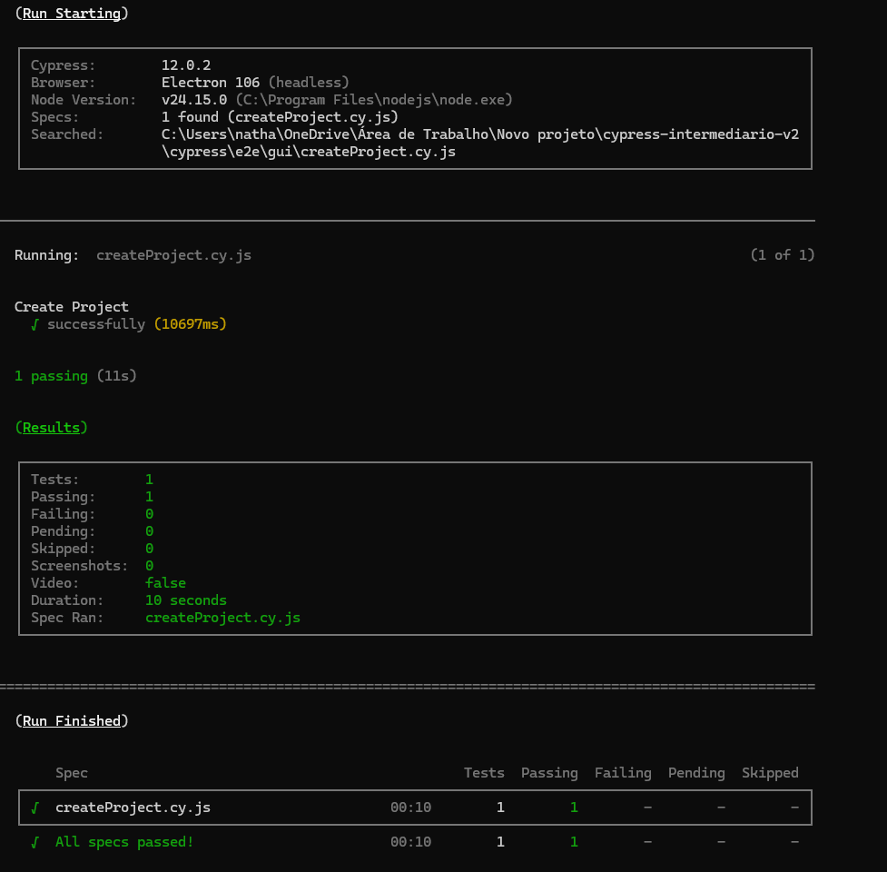
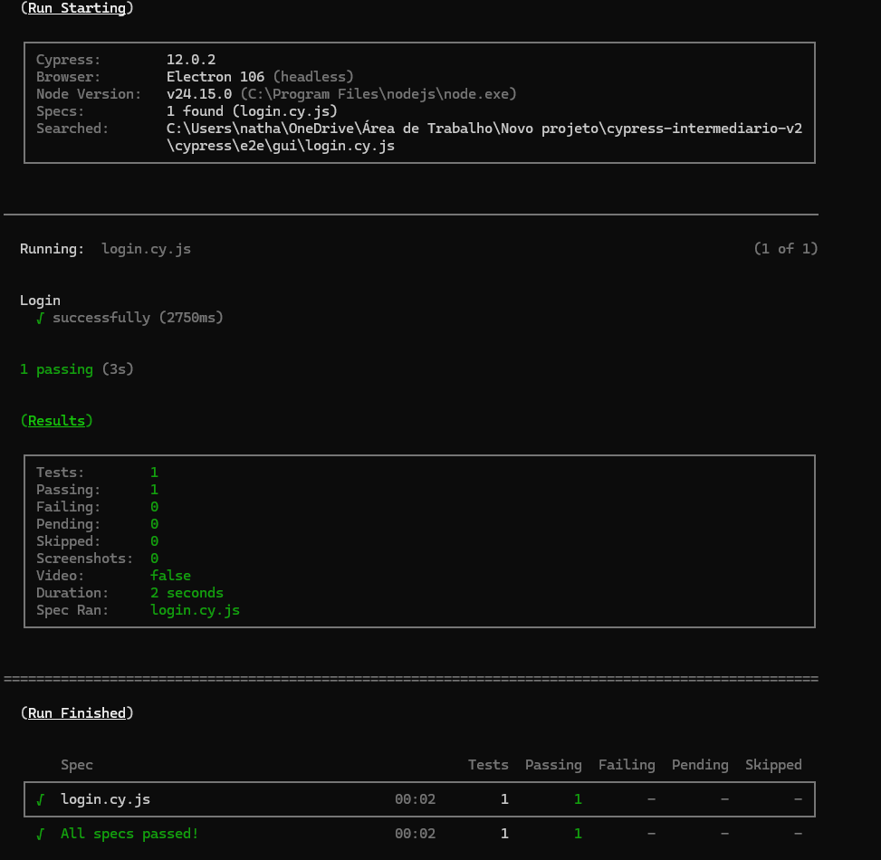
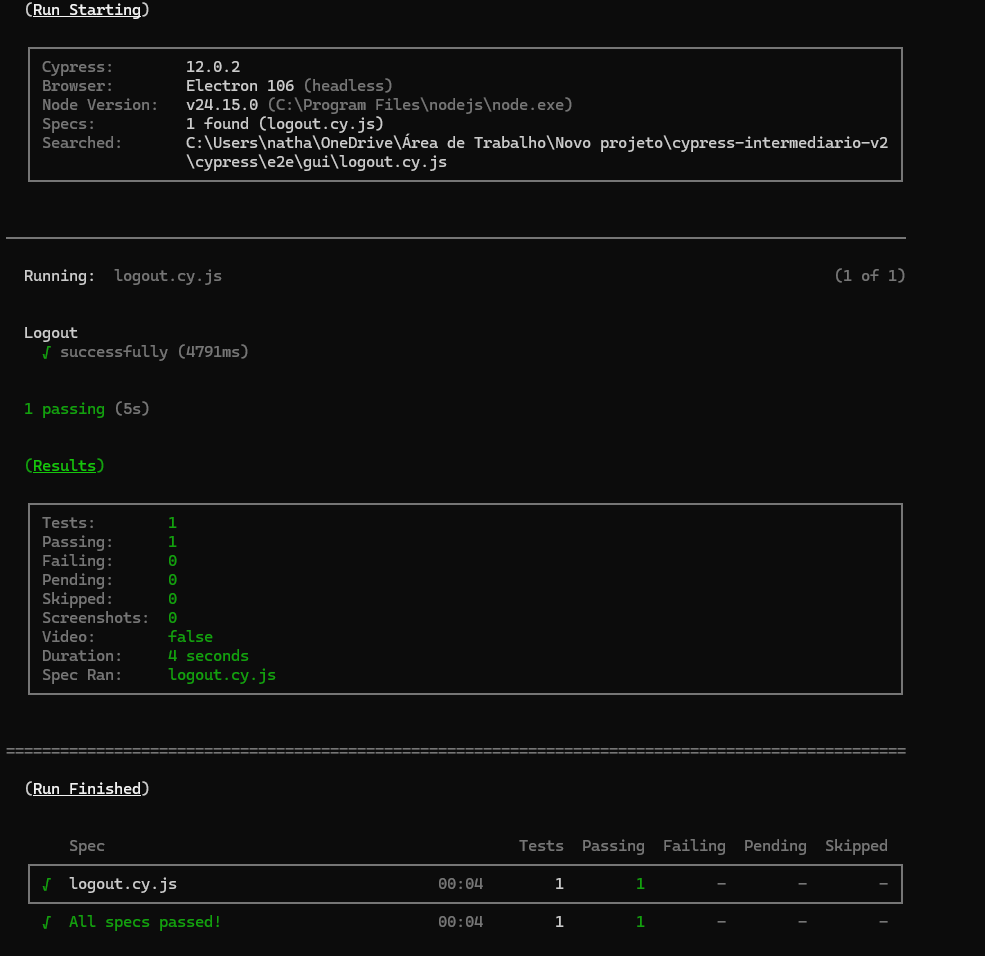
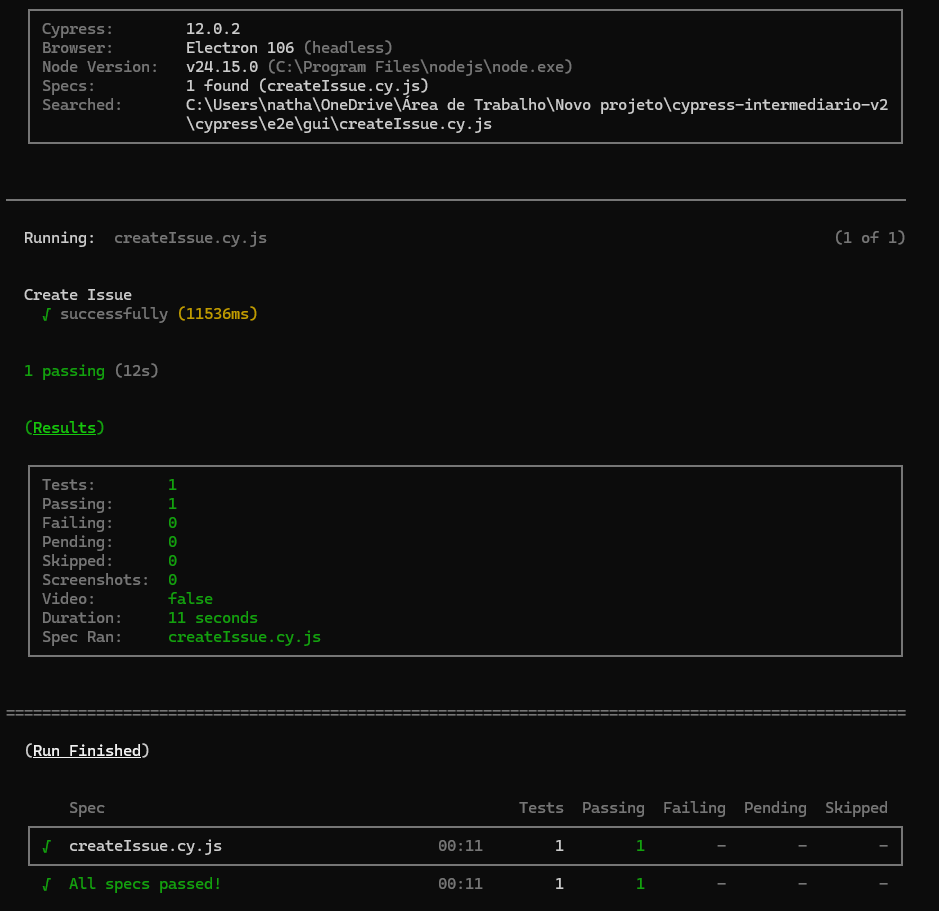
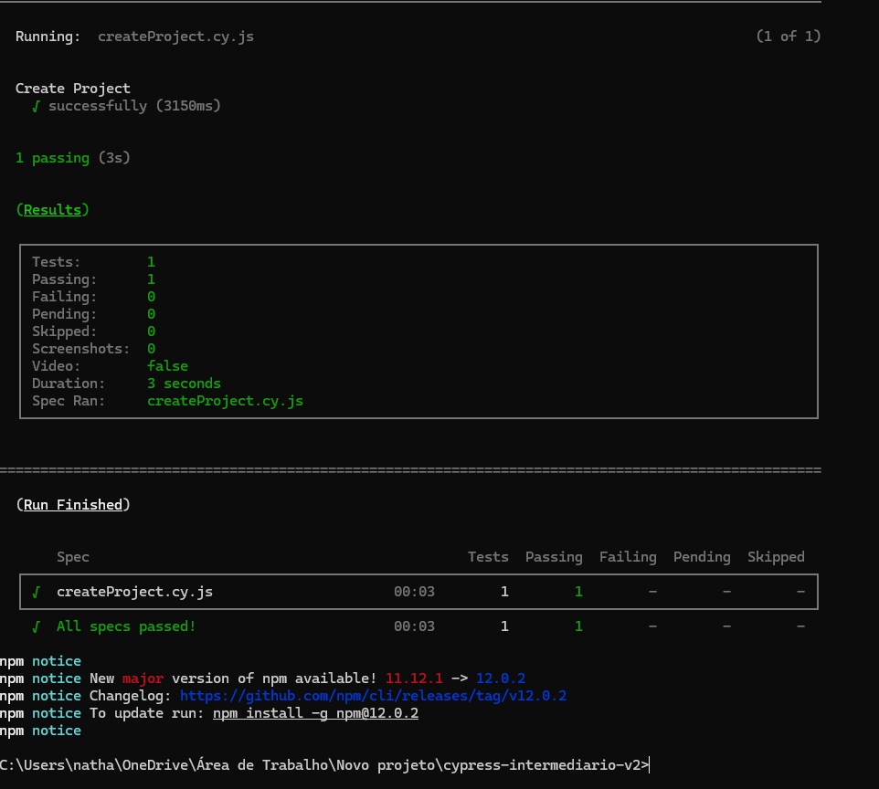
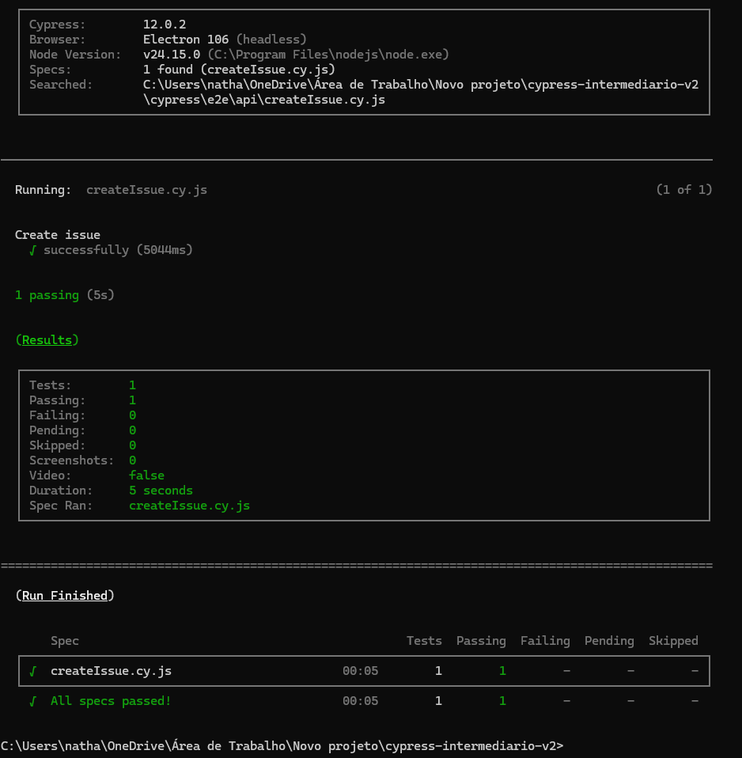
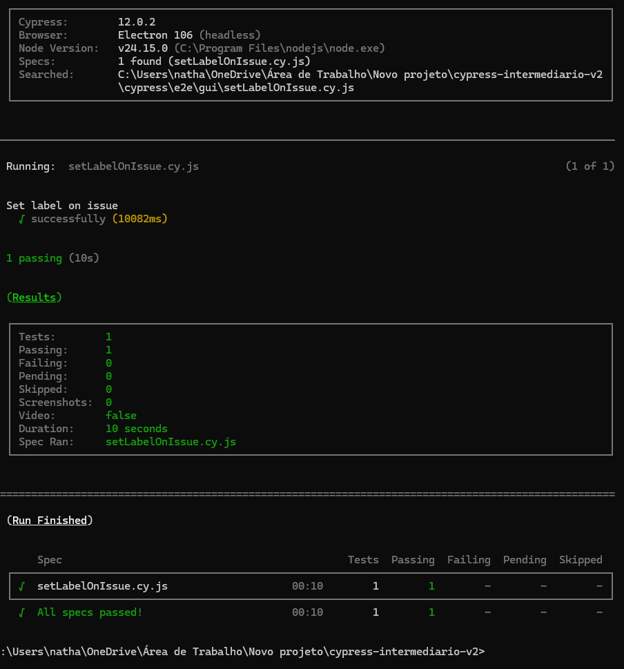
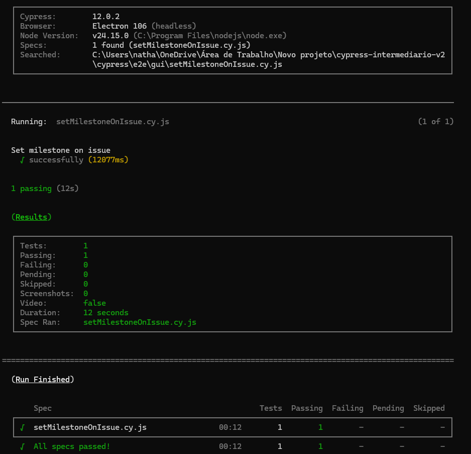
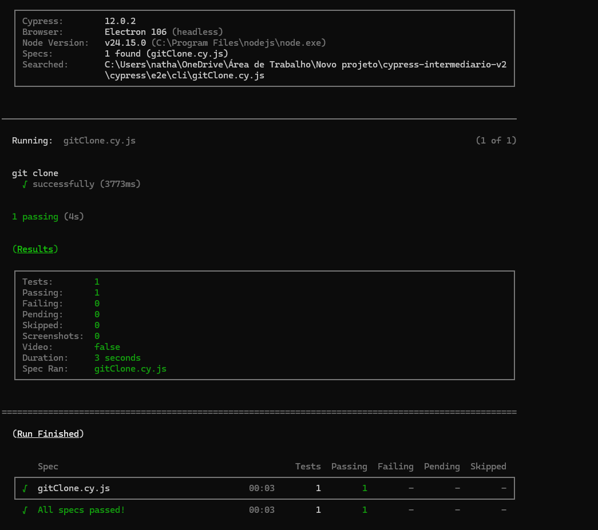

# Cypress GitLab Automation - Testes Automatizados

Projeto de testes automatizados desenvolvido durante o curso **Testes Automatizados com Cypress (Intermediário)** da [Escola TAT](https://www.udemy.com/user/walmyr/).

## Sobre o projeto

Testes automatizados de uma aplicação GitLab CE rodando localmente via Docker, cobrindo funcionalidades como login, logout e criação de projetos.

## Tecnologias utilizadas

- [Cypress](https://www.cypress.io/) `v12.0.2`
- [@faker-js/faker](https://fakerjs.dev/) `v7.6.0`
- [cypress-plugin-api](https://github.com/filiphric/cypress-plugin-api) `v2.6.1`
- [Docker](https://www.docker.com/)
- [GitLab CE](https://gitlab.com/gitlab-org/gitlab-foss) `v12.5.2`

## Pré-requisitos

- [Node.js](https://nodejs.org/) (versão LTS)
- [Docker Desktop](https://www.docker.com/products/docker-desktop/)
- [Git](https://git-scm.com/)

## Configuração do ambiente

### 1. Suba o GitLab com Docker

```bash
docker run --publish 80:80 --publish 22:22 --hostname localhost wlsf82/gitlab-ce
```

Aguarde alguns minutos até o GitLab inicializar. Acesse `http://localhost` e defina a senha do usuário `root`.

### 2. Clone o repositório

```bash
git clone https://github.com/nathalyamarianosilva-ship-it/cypress-intermediario.git
cd cypress-intermediario
```

### 3. Instale as dependências

```bash
npm install
```

### 4. Configure as variáveis de ambiente

Copie o arquivo de exemplo e preencha com suas credenciais:

```bash
cp cypress.env.json.example cypress.env.json
```

Edite o `cypress.env.json` com seus dados:

```json
{
  "user_name": "root",
  "user_password": "sua-senha",
  "gitlab_access_token": "seu-access-token"
}
```

## Executando os testes

### Modo headless (linha de comando)

```bash
# Todos os testes
npx cypress run

# Teste específico
npx cypress run --spec "cypress/e2e/gui/login.cy.js"
npx cypress run --spec "cypress/e2e/gui/logout.cy.js"
npx cypress run --spec "cypress/e2e/gui/createProject.cy.js"
```

### Modo interativo

```bash
npx cypress open
```

## Estrutura do projeto

```
cypress/
├── e2e/
│   ├── api/
│   │   ├── createProject.cy.js  # Testa a criação de projeto via API
│   │   └── createIssue.cy.js    # Testa a criação de issue via API
│   ├── cli/
│   │   └── gitClone.cy.js       # Testa o git clone via SSH
│   └── gui/
│       ├── login.cy.js              # Testa o login via GUI
│       ├── logout.cy.js             # Testa o logout via GUI
│       ├── createProject.cy.js      # Testa a criação de projeto via GUI
│       ├── createIssue.cy.js        # Testa a criação de issue via GUI
│       ├── setLabelOnIssue.cy.js    # Testa a adição de label em issue via GUI
│       └── setMilestoneOnIssue.cy.js # Testa a adição de milestone em issue via GUI
├── support/
│   ├── e2e.js                   # Arquivo de suporte principal
│   ├── api_commands.js          # Comandos customizados de API
│   ├── cli_commands.js          # Comandos customizados de CLI
│   └── gui_commands.js          # Comandos customizados de GUI
└── downloads/                   # Pasta para downloads dos testes
cypress.config.js                # Configurações do Cypress
cypress.env.json.example         # Exemplo de variáveis de ambiente
```

## Funcionalidades testadas

| Funcionalidade | Tipo | Arquivo |
|---|---|---|
| Login | GUI | `login.cy.js` |
| Logout | GUI | `logout.cy.js` |
| Criação de projeto | GUI | `createProject.cy.js` |
| Criação de issue | GUI | `createIssue.cy.js` |
| Criação de projeto | API | `api/createProject.cy.js` |
| Criação de issue | API | `api/createIssue.cy.js` |
| Adição de label em issue | GUI + API | `gui/setLabelOnIssue.cy.js` |
| Adição de milestone em issue | GUI + API | `gui/setMilestoneOnIssue.cy.js` |
| Git clone via SSH | CLI | `cli/gitClone.cy.js` |

## Evidências de execução

### Criação de projeto - All specs passed!


### Login - All specs passed!


### Logout - All specs passed!


### Criação de issue - All specs passed!


### Criação de projeto via API - All specs passed!


### Criação de issue via API - All specs passed!


### Adição de label em issue - All specs passed!


### Adição de milestone em issue - All specs passed!


### Git clone via SSH - All specs passed!


### Todos os testes (9 de 9) - All specs passed!

https://github.com/nathalyamarianosilva-ship-it/cypress-intermediario/blob/main/docs/all-tests-passed.mp4

| Spec | Tests | Passing | Duration |
|---|---|---|---|
| cli/gitClone.cy.js | 1 | 1 | 00:04 |
| api/createIssue.cy.js | 1 | 1 | 00:03 |
| api/createProject.cy.js | 1 | 1 | 00:02 |
| gui/createIssue.cy.js | 1 | 1 | 00:10 |
| gui/createProject.cy.js | 1 | 1 | 00:08 |
| gui/login.cy.js | 1 | 1 | 00:02 |
| gui/logout.cy.js | 1 | 1 | 00:02 |
| gui/setLabelOnIssue.cy.js | 1 | 1 | 00:08 |
| gui/setMilestoneOnIssue.cy.js | 1 | 1 | 00:05 |
| **Total** | **9** | **9** | **00:47** |

## Boas práticas aplicadas

- **`cy.session()`** para cachear e reutilizar sessão entre testes
- **Validação de sessão** para garantir independência entre testes
- **Dados dinâmicos** com `faker.js` para evitar conflitos
- **Comandos customizados** para reuso de código
- **Limpeza de dados** com `api_deleteProjects()` no `beforeEach` para garantir estado limpo
- **Otimização de pré-condições** usando API para criar recursos que não são o foco do teste
- **`cy.exec()`** para executar comandos a nível de sistema operacional (git clone via SSH)

---

Desenvolvido por [Nathalya Mariano](https://github.com/nathalyamarianosilva-ship-it)
